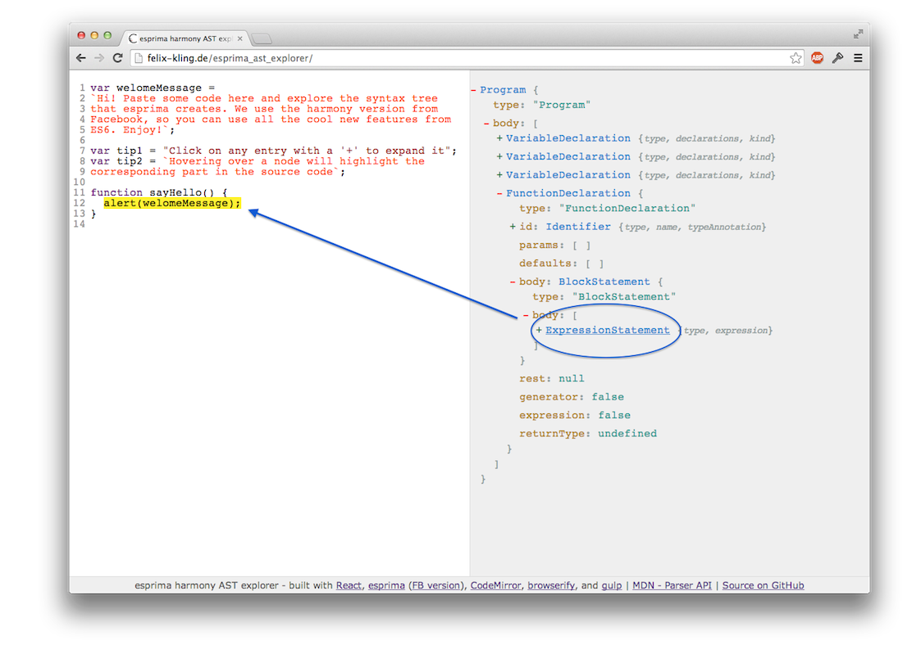
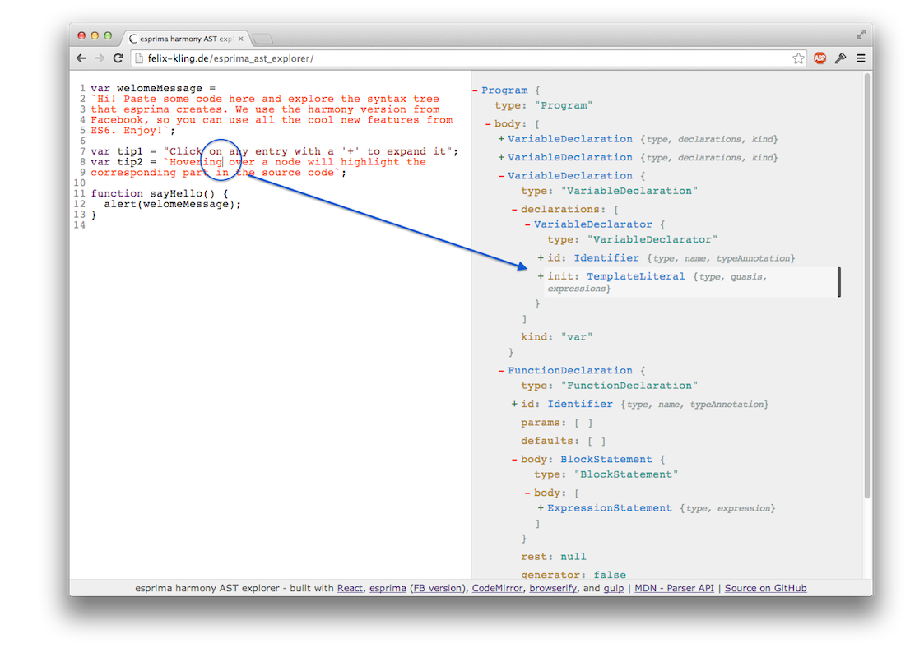

## An esprima AST explorer

Paste any ES6 or JSX compatible code into the editor and inspect the generated AST.

- Clicking on an AST node expands it
- Hovering over a node highlights the corresponding text in the source code:

- Editing the source or moving the cursor around will automatically highlight the
corresponding AST node (or its ancestors of it isn't expanded):

**Feedback is welcome!**

---

### Build your own version

Install gulp with `npm install -g gulp` and all dependencies with `npm install`.
Run `gulp watch` for incremental builds (while hacking the code), and
`gulp build` for the final minimized version.
