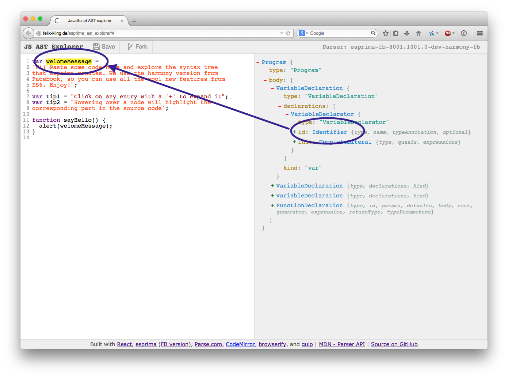
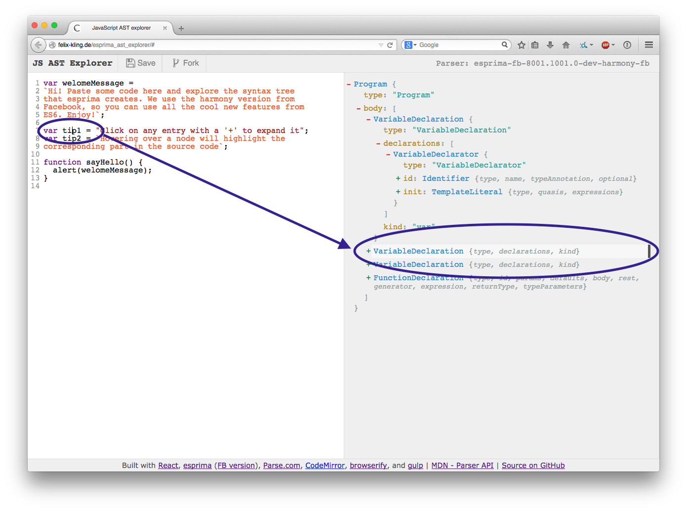

## AST explorer

Paste or drop code into the editor and inspect the generated AST.

The AST explorer provides following code parsers:

- JavaScript:
  - [esprima][]
  - [espree][]
  - [acorn][] + [acorn-jsx][]
  - [babylon][]
  - [recast][]
  - [shift][]
  - [babel-eslint][]
  - [traceur][]
  - [typescript][]
  - [uglify-js][]
  - [flow-parser][]
- CSS:
  - [cssom][]
  - [postcss][] + [postcss-safe-parser][] & [postcss-scss][]
  - [rework][]
- HTML:
  - [htmlparser2][]
  - [parse5][]
- [GraphQL][]
- [WebIDL][]

Depending on the parser settings, it not only supports ES5/CSS3
but also

- ES6: [arrow functions](https://github.com/lukehoban/es6features#arrows), [destructuring](https://github.com/lukehoban/es6features#destructuring),
  [classes](https://github.com/lukehoban/es6features#classes), ...
- ES7 propsals: [async/await](https://github.com/lukehoban/ecmascript-asyncawait), [object rest / spread](https://github.com/sebmarkbage/ecmascript-rest-spread),  ...
- [JSX](https://facebook.github.io/jsx/), known through [React](https://facebook.github.io/react/).
- Typed JavaScript ([Flow](http://flowtype.org/) and [TypeScript](http://typescriptlang.org/))
- [SASS](http://sass-lang.com/)

Since future syntax is supported, the JavaScript AST explorer is a useful tool
for developers who want to create AST transforms.

In fact, following transformers are included so you can prototype your own plugins:

- JavaScript
  - [babel][]
  - [ESLint][] (v1)
  - [jscodeshift][]
- CSS
  - [postcss][]

### Features

- Save and fork code snippets. Copy the URL to share them.
- Copying an AST or dropping a file containing an AST into the window will
parse the AST and update the code using [escodegen][].
- Otherwise, the content of texteditor will be replaced with the content of the file (i.e.
you can drag and drop JS files).
- Choose between multiple parsers and configure them.
- Toggle Transform mode with [jscodeshift][] and [babel][].
- shift+click on a node expands the full subtree.
- Hovering over a node highlights the corresponding text in the source code:

- Editing the source or moving the cursor around will automatically highlight the
corresponding AST node (or its ancestors of it isn't expanded):

- You can use `$node` in the console to refer to the last opened/toggled AST
node.

[acorn-jsx]: https://github.com/RReverser/acorn-jsx
[acorn]: https://github.com/ternjs/acorn
[babel-eslint]: https://github.com/babel/babel-eslint
[babel]: https://babeljs.io/docs/advanced/plugins/
[babylon]: https://babeljs.io/
[cssom]: https://github.com/NV/CSSOM
[escodegen]: https://github.com/estools/escodegen
[eslint]: http://eslint.org/
[espree]: https://github.com/eslint/espree
[esprima]: https://github.com/jQuery/esprima
[flow-parser]: https://github.com/facebook/flow/tree/master/src/parser
[graphql]: https://facebook.github.io/graphql/
[htmlparser2]: https://github.com/fb55/htmlparser2
[jscodeshift]: https://github.com/facebook/jscodeshift
[parse5]: https://github.com/inikulin/parse5
[postcss-safe-parser]: https://github.com/postcss/postcss-safe-parser
[postcss-scss]: https://github.com/postcss/postcss-scss
[postcss]: https://github.com/postcss/postcss
[recast]: https://github.com/benjamn/recast
[rework]: https://github.com/reworkcss/rework
[shift]: https://github.com/shapesecurity/shift-parser-js
[traceur]: https://github.com/google/traceur-compiler
[typescript]: https://github.com/Microsoft/TypeScript/
[uglify-js]: https://github.com/mishoo/UglifyJS2
[webidl]: https://github.com/darobin/webidl2.js

### Contributions

I'm happy about any feedback, feature request or PR to make this tool as useful
as possible!

#### How to add a new parser

1. Install the new parser as dependency: `yarn add theParser` (or `npm install -S theParser`)
2. Copy one of the existing examples in `src/parsers/{language}`.
3. Adjust the code as necessary:
  - Update metadata.
  - Load the right parser (`loadParser`).
  - Call the right parsing method with the right/necessary options in `parse`.
  - Implement the `nodeToRange` method (this is for highlighting).
  - Implement the `getNodeName` method (this is for quick look through the tree).
  - Implement `opensByDefault` method for auto-expansion of specific properties.
  - Define `_ignoredProperties` set or implement `forEachProperty` generator method for filtering.
  - Provide a `renderSettings` method if applicable.

#### How to add a new transformer

1. Install the new transformer as dependency.
2. Copy one of the existing examples in `src/parsers/{language}/transformers`.
3. Adjust the code as necessary:
  - Update metadata and `defaultParserID`.
  - Load the right transformer (`loadTransformer`).
  - Call the transformation method in `transform`.
  - Change sample transformation code in `codeExample.txt`.

#### Build your own version for development

1. Clone the repository.
2. Run `git submodule update --init` to initialize / update all submodules.
3. Install all dependencies with `yarn install` (you can run `npm install` as
   well).

Run `yarn run build` for the final minimized version.  
Run `yarn run watch` for incremental builds.

Run `yarn start` to start a simple static webserver.
